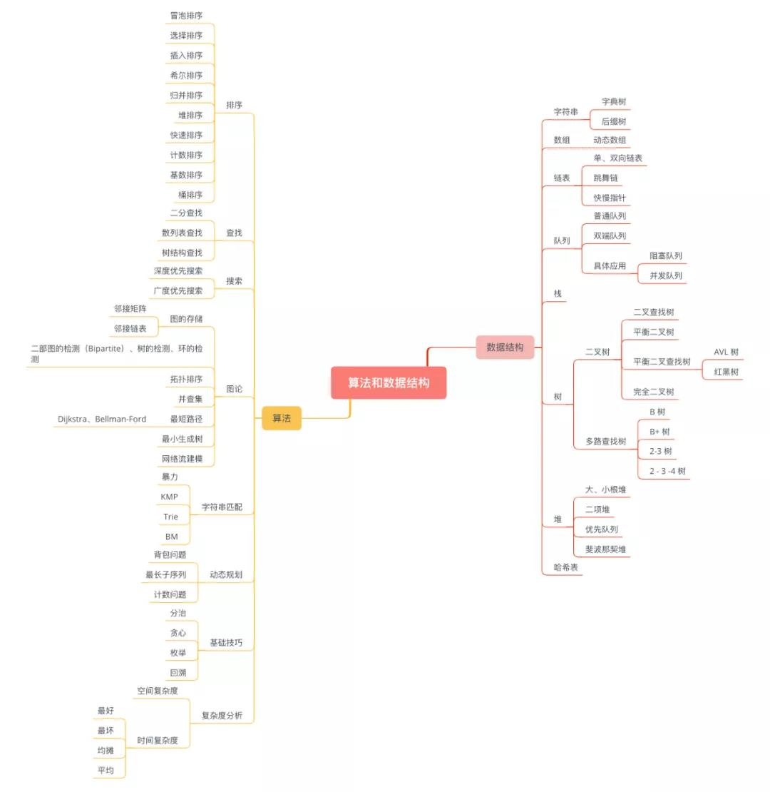

> **任何时刻，只要没有放弃战斗就还没有输，一切皆有可能**。相反，即使还有大把的时间和机会，如果我们内心中已经退缩或者放弃了，那么最终的结果就注定失败了。

兜兜转转，兜兜转转了 6 年（2015年6月10日 ～ 2021年8月30日），**我回到了我出发的地方！**

历年来，这些互联网大厂招聘**必考内容**都有数据结构和算法！**为什么要刷题？**自身算法能力和代码能力（**业务或思考转化为代码**）的提升。比如人工智能的研究方向需要经常要看论文复现代码，阅读论文开源的代码、实现新的算法做实验。代码能力上的提升就可以让代码读起来、写起来都比较快，而且不容易写出一些 Bug。

> 如果是 Go 后端工程师想要学习 LeetCode，可以考虑从这本书开始！

Cookbook——教授各种食谱美食的书，一般**动手操作**，**实践类的书**都有这个名字。

`LeetCode Cookbook` 来自 [`halfrost`](https://books.halfrost.com/leetcode/) 的写作：『对于自己来说，**写题解**也是一种提高。把一道深奥的题目讲给一点都没有头绪的人，并能让他完全听懂，很能锻炼人的表达能力。在**讲解**中很可能还会遇到听者的一些提问，这些问题可能是自己的知识漏洞，强迫自己去弥补。参加 ACM-ICPC 最大的收获是**训练了思维能力**，这种能力也会运用到生活中。**知识学会了，终身都是自己的，没有学会，那些知识都是身外之物**。**为何要追求 beats 100%**：笔者认为优化到 beats 100% 才算是把这道题做出感觉了。用暴力解法 AC 了，然后只 beats 了 5%，这题就如同没做一样。而且面试中如果给了这样的答案，面试官也不会满意，“还有没有更优解？”。如果通过自己的思考能给出更优解，面试官会更满意一些。』

**关于题解**，笔者建议这样使用：『先自己读题，思考如何解题。如果  15 分钟还没有思路，那么先看笔者的解题思路，但是不要看代码。有思路以后自己用代码实现一遍。如果完全不会写，那就看笔者提供的代码，找出自己到底哪里不会写，找出问题记录下来，这就是自己要弥补的知识漏洞。如果自己实现出来了，提交以后有错误，自己先 debug。AC 以后没有到 100% 也先自己思考如何优化。如果每道题自己都能优化到 100% 了，那么一段时间以后进步会恨到。所以总的来说，**实在没有思路，看题解思路；实在优化不到 100%，看看代码**。』

刷题只是提升算法能力的**手段**，**最终目的**应该是提升自我的**思维能力**。知识需要凝结成块，那么就把这些总结在最开始展示出来。当然这都是刷完题后，**梳理出的知识体系，是整个过程的结果**。那怎样才能真正掌握数据结构与算法呢？是把常用的数据结构与算法背得滚瓜烂熟吗？即便如此，面对现实世界的千变万化，你也不太可能照搬某个算法解决即将遇到的下一个问题。因此，就像学习设计模式、架构模式一样，**学习数据结构与算法的关键，在于掌握其中的思想和精髓，学会解决实际问题的方法**。

20个**最常用的、最基础**数据结构与算法：**10 个数据结构**：数组、链表、栈、队列、散列表、二叉树、堆、跳表、图、`Trie`树；**10个算法**：递归、排序、二分查找、搜索、哈希算法、贪心算法、分治算法、回溯算法、动态规划、字符串匹配算法。在学习每种数据结构和算法的过程中，**是要学习它的"来历"、自身的特点、"适合解决的问题"以及"实际的应用场景"**。

# 1 数据结构

| 数据结构                                                                                                                                      Data Structed |                             变种                             |
| :----------------------------------------------------------: | :----------------------------------------------------------: |
|                          顺序线性表                          |                                                              |
|                            单链表                            |      1. 双向链表；2. 静态链表；3. 对称矩阵；4. 稀疏矩阵      |
|                            哈希表                            |              1. 散列函数；2. 解决碰撞/填充因子               |
|                           栈和队列                           |                    1. 广义表；2. 双端队列                    |
|                             队列                             | 1. 链表实现；2. 循环数组实现；3. 双端队列；4. 优先队列；5. 循环队列 |
|                            字符串                            | 1. KMP 算法；2. 有限状态自动机；3. 模式匹配有限状态自动机；4. BM 模式匹配算法；5. BM-KMP 算法；6. BF 算法 |
|                              树                              |             1. 二叉树；2. 并查集；3. Huffman 树              |
|                         数组实现的堆                         |    1. 极大堆和极小堆；2. 极大极小堆；3. 双端堆；4. d 叉堆    |
|                          树实现的堆                          |   1. 左堆；2. 扁堆；3. 二项式堆；4. 斐波那契堆；5. 配对堆    |
|                             查找                             | 1. 哈希表；2. 跳跃表；3. 排序二叉树；4. AVL 树；5. B树、B+树、B*树；6. AA树；7. 红黑树；8. 排序二叉树；9. Splay 树；10. 双链树；11. `Trie` 树；12. R 树 |

# 2 算法

常用算法类型枚举如下：

1. **排序算法**：冒泡、插入、选择、Shell、快速、归并、堆、线性、自省、间接、计数、基数、桶、外部排序——k 路归并败者树、外部排序——最佳归并树；
2. **递归与分治**：二分搜索/查找、大整数的乘法、Strassen 矩阵乘法、棋盘覆盖、合并排序、快速排序、线性时间选择、最接近点对问题、循环赛日程表；
3. **动态规划**：
4. **贪心**：
5. **回溯法**：
6. 搜索：
7. **随机化**：
8. **图论**：
9. 数论：
10. **几何**：
11. **NP 完全**：
12. **位运算**：

刷题过程中，**重点在于将有相似套路的题目放在一起思考，总结出类似题目的解题套路**。如果想快速面试的话，其实相同的题目刷 2,3 道就可以了。相同类型的题目非常熟练的情况下，再多刷几道也是做无用功。

# 3 目录结构

1. base：数据结构与算法的基础知识，比如：时间和空间复杂度的概念等；
2. structures：数据结构的概念及其实现；
3. template：算法模板；
4. leetcode：LeetCode 算法试题及题解；

# 4 参考资料

1. 极客时间：《数据结构与算法之美》
2. [LeetCode-Go](https://books.halfrost.com/leetcode/)：一份关于 Go 语言的刷题详解
3. https://leetcode-cn.com/：LeetCode 中国官网

# 5 刷题技巧

> 我们真正需要的是 **系统学习** 并 **深刻理解** 不同数据结构及算法的**特征以及适用场景**。在真正掌握了**每个数据结构及算法的精髓**之后，针对典型的面试题进行必要的练习，那么在面试的就能以不变应万变，不管遇到什么样的面试题都能迎刃而解。

随着**互联网技术**的高速发展，计算机语言和开发平台日新月异，有些语言当年很火，时下已经不“流行”了，但**万变不离其宗**的是那些**算法和理论**。算法能力是设计一个高性能系统、性能优化的必备基础，它可以准确辨别一个程序员的技术功底是否扎实。因此，长期持之以恒地进行算法题目训练的重要性不言而喻，它不仅是**对程序思维的一种训练**，也是**衡量优秀程序员的一个标尺**。无论是找工作还是升学，具备一定的算法能力，才能够让你有机会去展现其他方面的能力。

算法训练是一个**系统工程**，需要**循序渐进**，**根据自身实际情况按需刷题**。如果你刷简单题都花费很长时间，说明基础不够牢固，就要从简单的算法基础知识学习开始；如果本身有一定的算法基础且熟练度高，则可以**按标签集中刷题或撰写题解**，同时，可以参加力扣竞赛，在比赛中提升限时编程能力，并保持对新题的敏感度。面试前可以进行心仪企业模拟面试，帮助面试冲刺。

* **▍新手模式**

  首先，刷题前你需要具备一些算法和数据结构的基础，这些基础包括：

  *  常考的数据结构：数组、字符串、链表、树（如二叉树）等
  * 常考的算法：分治、贪心、穷举、动态规划、回溯等

  而面试（笔试）考察的算法和高考数学题一样，都有**固定考察的知识点**。因此我们在准备面试（笔试）的时候，可以**按照知识点各个击破**。力扣的**「 学习」板块**就有很多已经**分好类**的免费教程。也可以在**力扣「题库」**中**按照标签筛选同类问题**，逐个掌握每个知识点的思考路径。

* **▍进阶模式**

  如果你已经具备一定的算法基础，**按力扣「题库」标签刷题**。根据题库页的 **「标签分类」** 进行针对刷题也是一个非常不错的选择。**持续地刷同个类型的题目**，可以不断地巩固和加深理解，并更全面地接触**这个算法知识点**的各个变种，这会促使你对某个算法知识点的理解更加全面和深刻，学习的效率会更高。

* **▍副本模式**

  如果有一定算法基础之后，刷题熟练度高，能力比较强的时候，可以打散题库进行刷题，还可以参加力扣竞赛，提升限时编程能力，同时，也可以进行企业模拟面试，帮助面试前冲刺。

梳理完刷题方法后，一份可执行的时间计划是非常重要的，大家可以根据自己的学习进度安排，下面列出一些计划的要点：

1. **确定学习方法**

   有的同学基础还比较薄弱，就需要花一定的时间梳理知识点，可以通过**力扣「学习」板块 - LeetBook 学习**或者看书学习，在刷题前至少保证一周左右的时间充分**梳理知识点**，而基础比较扎实的同学可以适当缩短梳理知识点的时间，或者直接从题目开始刷。

2. **计划刷题总数量**

   一般来说，**刷 150 - 200 题**就能比较充分地应对技术面试了。同学们可以根据时间按照实际情况调整。在这个基础上可以预估每天要花多少时间刷题，刷多少题。

3. **预留面试前复习时间**

   复习是刷题过程中非常重要的一个环节，刷了一定数量的题目后，可以准备一周的时间系统回顾错题和难题，避免出现面试时遇到做过的题仍然回答不上来的情况。

4. **安排实战演练和冲刺**

   在正式开始面试前的一到两周，你就需要进行大量实战演练和冲刺刷题了，可以在力扣「面试」页开始心仪公司的企业模拟面试。

算法能力的提升，是一个长期的事情，不管是想要通过刷题进入互联网名企还是提升自身职业素养，**持之以恒的算法训练**，**有效的执行计划**是必不可少的，没有**行动**，干货永远是干货，鸡汤永远是鸡汤，你永远是当初那个你！从现在开始，来力扣开始你的刷题计划吧！

# 6 算法与数据结构到底怎么学？

学习**数据结构**，首先要**熟练掌握**插入（同 Add）、删除、查找等**基本操作**，这些基本操作往往是解决很多面试题的**关键**。例如，如果我们熟练掌握了前缀树的插入和查找操作，那么很多跟字符串前缀相关的问题都很容易解决。再比如，基于基础数据结构如哈希表、链表等设计更加高级、复杂的数据结构（例如最近最少使用缓存）是近年来非常流行的面试题。其实这类题目也都是**利用基础数据结构来实现高级数据结构的插入、删除、查找等操作**。

此外，学习**数据结构**还要**深刻理解每种数据结构的特点及其适用场景**，这样才能在面试中**合理选择数据结构解决问题**。例如，**哈希表**是时间效率非常高的数据结构，它的插入、删除、查找操作的时间复杂度都是 O(1)。既然时间效率这么高，那是不是不管什么问题都能用哈希表解决？其实未必。如果存储的元素是字符串，而且需要根据字符串的前缀进行查找，那么**前缀树**是更好的选择。如果存储的元素是数字，并且解决问题需要知道数据集合里的最大值或者最小值，那么**堆**可能是更好的选择。如果需要对动态数据集合排序，并且需要根据数值的大小查找，那么**平衡的二叉搜索树**（Java 中的 TreeSet 或者 TreeMap）可能是更好的选择。

对于**基础算法**我们也需要**深刻理解**它们的**原理**以及**实现的代码**。例如，二分查找通常只需要 10 行左右的代码就能实现，我们要理解它的循环条件的比较运算符什么时候是“<”，什么时候是“<=”，确定下一步应该查找前半部分或者后半部分的标准是什么。理解了这些原理之后，不管面试题怎么变化，只要面试题是关于在排序（可能只是部分排序）数组中的查找问题，都可能基于二分查找解决，而最终解决问题的代码都大同小异。

同样的，学习**算法**也要**理解每种算法的特点及其适用场景**。例如**回溯法**和**动态规划**适合解决的问题看起来很类似。如果解决一个问题需要多个步骤，并且每个步骤都面临多个选择，那么我们可以考虑使用回溯法或者动态规划解决这个问题。如果问题要求列举出问题所有的解，那么我们应该采用回溯法解决问题。如果问题只是要求计算某个最优解（通常是最大值或者最小值）或者计算解的数目（或者判断解是否存在），那么我们应该采用动态规划解决问题。

举例而言，给你一个没有重复数字的正整数集合，请找出所有元素之和等于某个给定值的所有组合。同一个数字可以在组合中出现任意次。如果面试官要求我们列举出所有可能的集合，那么这是一个考查回溯法的问题。如果面试官要求我们计算符合条件的集合里最少包含几个数字，即计算某个最优解，那么这就变成了一个考查动态规划的问题了。

程序员需要学习很多新知识，在学习的过程中定期总结能够**发现问题**，能帮助自己**及时调整方向**。

有不少扣友会遇到「刷力扣时经常陷入刷了忘忘了刷的尴尬局面」，**如果盲目刷题而不思考，除了花费大量精力以外，还无法得到想要的效果**。那么对于这个问题可以从哪些方面考虑呢？

**▍及时发现问题**

刷了就忘的根本原因是**没有真正理解解题思路**，解题不应该要求做过的问题都能记住答案。忘了说明以前做的时候就没有真正理解，试图回忆解题步骤是不正确的，应该尝试回忆**解题思路**。但更有效的做法是 **在刷题的时候就深刻理解解题思路**。

> 我自己的思维里，就有这样的**思维“误区”**。总是想要去回忆**答案**，而不是**思考的过程**！

**▍思考出题目的**

刷题就是一遍遍做题，巩固知识点的过程。平常做题时没有思路，看题解是非常正常的。但是我们在看题解的时候，不要只看解法，记住算法，而**应该去思考算法为什么这样设计**。多问一问自己：

- 算法为什么这样设计？为什么想到「二分查找」、为什么想到「滑动窗口」、为什么想到「双指针」？
- 为什么求最短路径用「动态规划」和「广度优先遍历」、为什么有一些最优化问题可以用「贪心算法」，直觉来自哪里，如何证明？

**▍掌握正确的刷题方法**

面试考察的**算法**和**高考数学题**一样，都有**固定考察的知识点**。因此我们在准备面试（笔试）的时候，可以**按照知识点各个击破**。「力扣」的 [学习 ](https://leetcode-cn.com/leetbook/)板块就有很多已经分好类的免费的教程。也可以在「力扣」中按照**标签**筛选同类问题，逐个掌握每个知识点的思考路径。

**▍抓大放小，提高刷题效率**

在时间有限的前提下，应该注重基础算法、数据结构、常见（高频）问题的准备，不应该只满足于做对这个问题，而应该以 **能够在面试的时候清晰地向面试官表达解题思路** 为目标。

# 7 编程面试怎么准备？

在准备面试时，要注重**总结常用的解题思路**。例如，如果一个面试题提到与二叉树层相关的概念，那么我们可以尝试用广度优先搜索算法解决这个问题。再比如，如果关于图的问题关注的是路径的最短距离，那么可以采用广度优先搜索解决；如果面试题重点关注的是路径本身，那么可能深度优先搜索算法更加适合用来解决问题。

同时也建议大家在准备面试时注重**总结常用的代码模板**。有一些经典的数据结构或者算法的实现代码，我们可以将它们**当作模板**用来解决很多相关的面试题。只要我们能够理解这些模板里代码的来龙去脉，这样在面试中如果遇到类似的问题就能**套用相应的模板解决**，轻松做到举一反三。例如用并查集解决跟图相关问题时合并和查找操作的代码都大同小异，在合适的时候套用 union 和 findFather 两个函数就能解决很多与图相关的问题。

准备编程面试不是一件轻松的事情。但如果我们既能**深刻理解单个数据结构和算法的原理以及实现代码**，并能**横向比较不同数据结构和算法的特点以及应用场景**，注意**总结常用的解题思路**和**代码模板**，那么必定能顺利通过面试并最终拿到心仪 Offer。

# 8 如何应对一道白板编程题？

所谓白板编程题就是在白板上或者编辑器里**完整地**解答算法或者数据结构的问题。

在此之前，我们首先需要了解为什么会有白板面试的过程。需要明确的是，**它一定不是一个考试**。**面试是一个交流的过程**，我们其实模拟的是在现实情况下解决问题的过程，所以千万不要不好意思去问一些问题，甚至去要一些提示。

针对这个问题，接下里我会给出**一个解题五步走的模板**：

**▍第一步：明确题意，注意和面试官交流题意**

很多扣友拿到一道问题后觉得这道题目我看过，或者我已经有思路了，于是直接就开始写解答。但是，有的时候题目的描述并不是很清楚，有的时候可能有一些边界条件、边界问题没有非常直白地告诉你应该去怎么处理，这时候你**需要问面试官一些问题**。

问的问题包括题目本身，比如有的题目题干比较长，你并不是很理解它在说一件什么事情，**你可以用自己的话描述一下，确认你的理解是正确的**。第二，你可以事先想想，这个题目会有哪些边界条件，并且预期面试官会有一个什么样的解答。

**▍第二步：大致描述你的算法思路**

这一步也非常关键，原因在于有可能你想的方法其实并不是面试官所想的，或者并不是面试官认为足够有效可以解决这个问题的。

所谓的**描述一个大致的算法就是一个打草稿过程**。你可以想象，如果面试官让你去画一幅画，上面需要画五个人。你的第一步肯定是用铅笔先在稿纸上大致把五个人的位置画好，而不是上来就画细节。

**当我们描述时，可以从一个最简单的思路讲起，再到更优化的**。举一个简单例子，你要在一个数组中，选出第 k 大的数。可能你直觉的想法就是把它排序一下，然后取到第 k 大。但实际存在更优的解法，比如用 k selection algorithm 达到 O(n) 的一个选择复杂度。

就这样，**通过描述算法，你已经在逐渐形成你的思路**。

这样做有两个好处。第一，你的算法不至于跑的太偏。第二，至少有一个保底的做法。哪怕你只想到了暴力解（Brute Force），至少不至于这道题目一行代码也写不出。

在描述的过程中，也可以借助一些方法技巧。比如可以写一些伪代码，或者加一些程序的框图，帮助你把你的思路转化成代码。

**▍第三步：写代码**

这一步需要注意一些细节问题。

在明确题意的时， 既然已经知道了哪些是 edge case，所以你的代码一定要去处理这些**边界的条件**。

你需要有一个良好的**代码书写习惯**，包括你的**命名规范**。当你定义变量的时候，不要图省事就用 int A、int B。这些其实在面试中都是一些 Red Flag。

如果你想说这个变量名应该是取某个名字，但是为了手写简单我用了这个缩写，至少要将这些想法表述出来，给面试官留下一个你有好的书写习惯的印象。

好好利用一些**子函数**，把应该放成一个模块的内容写成子函数，而不是直接摊在你的整个函数里面。这时我们就回到第二步，当你在描述思路的时候用铅笔画出了一个粗框架，对于里面的每个步骤，你可以考虑是不是要把它变成一个子函数。

你甚至可以向面试官解释这个子函数是为了实现一个什么样的功能，但是限于时间我先跳过。可能面试官觉得你的思路很清晰，就不需要你去写这个函数了。这样不至于把大量的时间花在一些非常细节的问题上，而能够保持你面试流程流畅。

写代码的过程中，你需要**跟面试官保持沟通**，让 Ta 知道你在想什么。而且一旦偏差得太远，希望面试官能够把你拉回来。**如果你碰到了一些问题，可以及时地问面试官要 hint（而非答案）** 。比如，我现在在想什么问题，碰到了什么样的困难， 我觉得这样可能可以，你能不能给我一些更好的建议。

**▍第四步：测试你的代码**

很多扣友写完代码以后非常开心，直接就对面试官说：我完成了，你来看看我写的对不对。但事实上，这句话就相当于在考试中交卷了。一旦你里面有问题，或者有没有考虑到的地方，都已经板上钉钉了。

所以，不要急着说我写好了，而是应该通过一个**测试用例（特别是一些边界测试用例）**来测试一下你的代码是不是能够顺利运行。如果是在白板上答题，可以给出一个示例，像 debug 一样一步一步地去执行你的代码。如果是在编辑器里， 你可以给出一个测试用例来大致跑一下。

> 小提示： 如果在面试的过程中，你通过测试发现了代码中的问题，并且及时把它改正了，这会是一个加分项。

**▍第五步：简单分析一下算法复杂度**

主要是时间复杂度和空间复杂度。做这一步的理由就是让面试官认为你有一个比较好的基础素养，能正确地评估自己代码的复杂度。

不过这一步整体来说是 optional 的，并不一定要去做。所以如果你不确定自己的答案，那就先不说，除非面试官明确地问。
