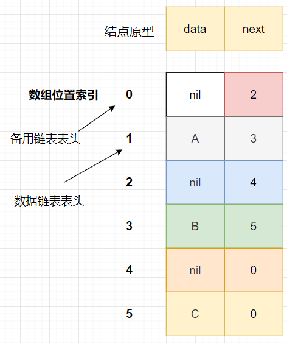

在 [基本数据结构：线性结构](./1.md) 中我们看到了数组和链表这 2 种线性表结构的特点，下面归纳如下：

> Typera 仅支持文件名为非中文的文件链接！上面这种情况是无法链接过去的。

* 数组和链表都是线性表数据结构，元素之间的逻辑关系都是“手拉手”的关系；
* 数组的存储结构是连续的内存单元，且初始化时其容量是固定的；链表的存储结构是非连续的内存单元，其天然支持动态扩容；
* 数组支持元素的“随机访问”，这个特征依赖于存储特性，因此元素随机访问的时间复杂度是 O(1)，而插入和删除的时间复杂度则是 O(n)。与之对应的链表，不支持“随机访问”，但是其插入和删除的时间复杂度是 O(1)。

那**是否有一种数据结构能够融合上述两种数据结构的优势呢？**静态链表，就是这样的，那我们来验证下是否做到了融合优势的特点。比如：在时间复杂度的分析中，数组这种数据结构在执行插入、删除时，为了保证数据的连续性都有“移动”操作。那静态链表是否能**避免这种数据移动操作**？

定义：**用数组描述的链表结构，就是静态链表**。它的主要优势是插入、删除元素时，不需要移动数据，仅修改 next 域值即可。

静态链表存在的 **3 个组成部分**：

* 用于存储数组的数组，每个结点的构成包含了：data 和 next 域；
* **数据链表**：next 域就是与之相关的下一个结点所在的数组 index 值，即线性关系：
* **备用链表**：**未使用结点**的线性关系，其中 next 域存储的值是下一个未使用的 index 索引。

用一个例子来入门：

为了**工程实用性**，默认的认为**备用链表的表头**位于数组 index 为 0 的位置，而**数据链表的表头**位于数组 index 为 1 的位置。

上图构建的一个静态链表中，数组 index 为 0 的 Node 是备用链表的表头结点，数组 index 为 1 的 Node 是数据链表的表头结点。从备用链表的各个结点的指向关系，我们找到了静态链表中还没有使用的结点位置，即数组 index 值是 2 和 4 的位置；从数据链表的各个结点的指向关系，我们可遍历当前静态链表：A、B、C。

**重点掌握**的是：这种基本数据结构——静态连败哦——的增加（insert）、删除、查找、遍历**基础操作**的**执行过程**。

下面，我们先来构造一个静态链表：

~~~go
const (
	N                    = 5
	NONE_NODE_FLAG_INDEX = -1
)

type StaticLinkedList struct {
	list [N]*Node

	first int // 数据链表的第一个结点 index 值
	last  int // 数据链表的最后一个结点 index 值
}

type Node struct {
	ele  rune // ele 默认值是 0
	next int  // 只要 next 值为 LAST_NODE_FLAG_INDEX，就表示是最后一个结点
}
~~~

创建一个静态链表：

~~~go
func (list *StaticLinkedList) create() {
	if N <= 1 {
		panic("静态链表元素个数 N 至少包括 2 个结点！")
	}
	node := &Node{
		next: 1, // 首个可用结点的 index 值
	}
	list.list[0] = node
	list.last = NONE_NODE_FLAG_INDEX
	// FIXME 待修订！
	list.first = 1
}
~~~

向静态链表中增加结点：

~~~go
// addLast 从备用链表中取出一个可用 index，并创建 Node 放置于 index 处
func (list *StaticLinkedList) addLast(ele rune) bool {
	availableNode := list.list[0]
	noUsedIndex := availableNode.next
	if noUsedIndex == NONE_NODE_FLAG_INDEX {
		fmt.Println("已满！")
		return false
	}

	fmt.Printf("ele:%c, noUsedIndex:%d\n", ele, noUsedIndex)

	newNode := &Node{
		ele:  ele,
		next: NONE_NODE_FLAG_INDEX,
	}

	if list.last != NONE_NODE_FLAG_INDEX {
		lastNode := list.list[list.last]
		if lastNode == nil {
			panic("last node is nil!")
		}
		lastNode.next = noUsedIndex
	}

	list.list[noUsedIndex] = newNode
	//FIXME 找不到下一个 nextNoUsed
	list.list[0].next = nextNoUsed
	return true
}
~~~

很有意思的是，上述 addLast 方法中第 27 行“断线”了，**新增加结点后，`list.list[0].next` 不知道赋值什么**！

静态链表如何初始化？**特别是备用链表的 next 域赋值问题**。

输出静态链表内容：

~~~go
func (list *StaticLinkedList) printAll() {
	// *Node 类型
	for index, node := range list.list {
		if node != nil {
			fmt.Printf("index:%d, ele:%c, next:%d\n", index, node.ele, node.next)
		}
	}
}

// printEle 从 list.first 开始的所有元素值
func (list *StaticLinkedList) printEle() {
	node := list.list[list.first]
	for {
		if node == nil {
			break
		}
		fmt.Printf("ele:%c, next:%d\n", node.ele, node.next)
		node = list.list[node.next]
	}
}
~~~

**特定的数据结构，是对特定场景的抽象**。那静态链表这种数据结构的使用场景是什么？

