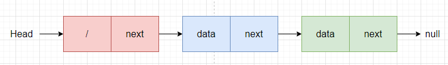

> 数据结构和算法有什么关系呢？**为什么大部分书都把这两个东西放到一块儿来讲呢**？这是因为，**数据结构和算法是相辅相成的**。**数据结构是为算法服务的，算法要作用在特定的数据结构之上**。因此，我们无法孤立数据结构来讲算法，也无法孤立算法来讲数据结构。比如，因为数组具有**随机访问**的特点，常用的二分查找算法需要用数组来存储数据。但如果我们选择**链表**这种数据结构，二分查找算法就无法工作了，因为链表并不支持随机访问。
>

**什么是数据结构**？数据结构就是一组数据的存储结构。而算法则是操作数据的一组方法。数据结构是**静态的**，它只是**组织数据的一种方式**。如果不在它的基础上操作、构建算法，孤立存在的数据结构就是没用的。**我们在总结线性表时，要特别注意数据结构的特点、使用场景和（与其他数据结构的使用）区别。**

线性表和非线性表的概念：

* 线性表就是**数据排成像一条线一样的结构**。**每个线性表上的数据最多只有前和后两个方向**。**其实除了数组，链表、队列、栈等也是线性表结构**。
* 非线性表，比如**二叉树、堆、图**等。之所以叫非线性，是因为，**在非线性表中，数据之间并不是简单的前后关系**。

线性表数据结构有：**数组、链表、栈和队列**。更深入来看：此处的线性表结构可笼统认为是一种**逻辑**关系，是**一种元素间的逻辑关系**，类似于“手拉手”的关系。但站在**存储结构**的观点上来看，数组和链表则是一种完全不同的数据结构，前者存储在内存的相邻单元，而后者则是零散分布在内存中。另外，对于栈和队列的区分，其区别点则在**数据结构中元素的操作**上，插入、删除操作的限制让数组、链表扩展出了新的数据结构。

因此，总的来说，线性表结构需要考虑的是：**数据逻辑结构**、**存储结构**和**数据的操作**。这样思考：

1. 数据结构的**逻辑结构**：数据结构中各个元素之间的逻辑关系。比如对于线性表就是数据排成**像一条线一样的结构**。每个线性表上的数据最多只有**前和后两个方向**；而非线性表，数据之间并**不是简单的前后关系**。从数据结构的逻辑结构层面来看，可以**分为线性表和非线性表这 2 种**。
2. 数据结构的**存储结构**：数据结构在实现上，各个内存之间的关系。比如**数组**是使用连续的内存空间存储各元素内容，**链表**则是使用非连续内存存放元素内容。
3. 数据结构中**数据的操作**：栈和队列的区别就在此，认为规定了栈顶（栈底）和队列首部（队列尾部）。对于栈来说，只能在栈顶操作，是 FILO 型的；对于队列来说，只能在队列首部出队，在队列尾部入队，是 FIFO 型的。

# 1 数组

数组( `Array` )是一种线性表数据结构。它用一组**连续的内存空间**，来存储一组具有**相同类型的数据**。从概念上来说，这种数据结构有如下特性：

* 线性表结构：元素之间的关系类似于“手拉手”；
* 连续的内存空间，存储相同类型的数据（每个元素占用内存空间相同）：**具备了一个堪称"杀手锏"的特性——“随机访问”**，随机访问的时间复杂度是 O(1)。

**重点掌握**的是：这种基本数据结构——数组——的增加（insert）、删除、查找**基础操作**的**执行过程**。

> ”链表适合插入、删除，时间复杂度 `O(1)`；数组适合查找，查找时间复杂度为 `O(1)`"。这种说法实际是错误的！
>
> 数组是适合查找操作，但是**查找的时间复杂度并不为 `O(1)`**。即便是排好序的数组，你用二分查找，时间复杂度也是 `O(logn)`。所以，正确的表述应该是**，数组支持随机访问，根据下标随机访问的时间复杂度为 `O(1)`**。
>
> 查找是一种**算法**，是一种基于具体数据结构上的算法，比如二分搜索/查找。

先来看看**插入操作**，数组这种数据结构的**内存连续性**严重影响了插入操作的效率。假设数组的长度为 `n`，现在，如果我们需要将一个数据插入到数组中的第 `k` 个位置。为了把第 `k` 个位置腾出来（**保持存储的连续性**），给新来的数据，我们需要将第 `k ~ n` 这部分的元素都顺序地往后挪一位。如果在数组的末尾插入元素，那就不需要移动数据了，这时的时间复杂度为 `O(1)`。但如果在数组的开头插入元素，那所有的数据都需要依次往后移动一位，所以最坏时间复杂度是 `O(n)` 。因为我们在每个位置插入元素的概率是一样的，所以平均情况时间复杂度为 `( 1 + 2 + ... + n) / (n + 1) = O(n)`。

如果数组的**数据是有序的**，插入数据时，就必须按照上述过程移动元素，保持存储元素内存的连续性。**如果数组中存储的数据并没有任何规律**，数组只是被当作一个存储数据的集合（容器）。在这种情况下，如果要将某个数组插入到第 `k` 个位置，为了避免大规模的数据搬移，我们还有一个简单的办法就是，直接将第 `k` 位的数据搬移到数组元素的最后，把新的元素直接放入第 `k` 个位置（相当于是做一次交换）。

再来看看**删除操作**，跟插入数据类似，如果我们要**删除第 k 个位置的数据**，为了内存的连续性，也需要搬移数据，不然中间就会出现空洞，内存就不连续了。和插入类似，如果删除数组末尾的数据，则最好情况时间复杂度为 `O(1)`；如果删除开头的数据，则最坏情况时间复杂度为 `O(n)`；平均情况时间复杂度也为 `O(n)`。实际上，在某些特殊场景下，我们并不一定非得追求数组中数据的连续性。如果我们将多次删除操作集中在一起执行，删除的效率就会提高很多！每次的删除操作并不是真正地搬移数据，只是记录数据已经被删除（元素的 isDelete 标记）。**当数组没有更多空间存储数据时**，我们**再触发**执行一次真正的删除操作，这样就大大减少了删除操作导致的数据搬移。这就是 JVM 的**标记清除垃圾回收算法**的核心思想！

下面，我们以 Java 语言内部实现的容器类 ArrayList 为原型，来分析数组的操作：

~~~java
/**
 * 向 Array 中增加 value 元素，默认向 Array 尾部增加
 * 
 * @param value
 *            待加入的元素值
 * @return true 增加成功，反之，失败
 */
public boolean add(int value) {
	return insert(size, value);
}

/**
 * 向 Array 的指定 index 位置索引插入数值，待插入位置索引不能超出 size（Array 中已存入的元素个数，或者表示下一个添加元素的位置索引）
 * 
 * @param index
 *            待插入位置索引
 * @param value
 *            待插入数值
 * @return true 插入成功，反之，失败
 */
public boolean insert(int index, int value) {
	if (size == capacity) {
		// 若插入成功，需提前判断 Array 容量是否够用
		System.out.println("已无可用空间");
		return false;
	}

	// 允许在 size != capacity 的情况下，在数组末尾增加元素，此时 index 值为 size
	if (index < 0 || index > size) {
		System.out.println("待插入位置索引，不正确");
		return false;
	}
	
	// 允许在 index 值为 size 的地方插入数据，相当于是数组末尾插入
	
	// TODO 方式一：从 Array 尾部依次将元素向后挪动
	/*for (int m = size - 1; m >= index; --m) {
		array[m + 1] = array[m];
	}*/

	// TODO 方式二：从 Array 尾部依次将元素向后挪动，更加直观，代码可读性更强
	for (int m = size; m > index; --m) {
		array[m] = array[m - 1];
	}

	// 在指定位置插入数据
	array[index] = value;

	// 对于此处需要更新 size 的情况，可采用 ++size，因为该语句的目的就是让 size 自增
	++size;

	return true;
}

public int remove(int index) {
    if (index >= size){
        System.out.println("待移除的 index 超出可用范围，其中包含了：array 为空的情况");
    }
    int oldValue = array[index];
    
    int numMoved = size - index - 1;
    for (int i = 0; i < numMoved; i++){
        array[index + i] = array[index + i + 1]
    }
    --size;
    return oldValue;
}
~~~

**数组用一块连续的内存空间，来存储相同类型的一组数据**，最大的特点就是支持随机访问，但插入、删除操作也因此变得比较低效，平均情况时间复杂度为`O(n)`。在平时的业务开发中，我们可以直接使用编程语言提供的容器类，但是，如果是特别底层的开发，直接使用数组可能会更合适。

# 2 链表

链表是一种经常和数组比较的数据结构，但区别在于：数据存储结构是**分散的**，而不是像数组那样连续的内存占用（**内存的组织方式**）。

**数组**需要一块**连续的内存空间**来存储，**对内存的要求比较高**。如果我们申请一个 `100MB` 大小的数组，当内存中没有连续的、足够大的存储空间时，即便内存的剩余总可用空间大于 `100MB`，仍然会申请失败。而**链表**恰恰相反，它并**不需要一块连续的内存空间**，它**通过“指针”**将一组**零散的内存块串联**起来使用，所以如果我们申请的是 `100MB` 大小的链表，根本不会有问题。

三种最常见的链表结构，分别是：**单链表**、**双向链表**和**循环链表**。这些多种多样的链表实际都是对单链表的应用，在其基础上做的改进和创新！

**链表通过指针将一组零散的内存块串联在一起**。其中，我们把内存块称为**链表的“结点”**。为了将所有的结点串起来，每个链表的结点除了存储数据之外，还需要记录链上的下一个节点的地址。如图所示，我们把这个记录下个结点地址的指针叫作**后继指针`next`**。

在上图的**单链表**中，你应该可以发现，其中有两个结点是比较特殊的，它们分别是**<u>第一个结点</u>**和**<u>最后一个结点</u>**。我们习惯性地把第一个结点叫作**头结点**，把最后一个结点叫作**尾结点**。其中，<u>头结点用来记录链表的**基地址**。有了它，我们就可以遍历到整条链表（找到头结点，就可以依次遍历所有单链表）</u>。而尾结点特殊的地方是：指针不是指向下一个结点，而是指向一个**空地址 `NULL`**，表示这是链表上最后一个结点。

> 上图中的头结点，就是第一个结点。

**重点掌握**的是：这种基本数据结构——链表——的增加（insert）、删除、查找**基础操作**的**执行过程**。

在链表中插入或者删除一个数据，我们并不需要为了保持内存的连续性而搬移结点，因为链表的存储空间本身就不是连续的。所以，**在链表中插入和删除一个数据是非常快速的**。针对链表的插入和删除操作，我们只需要考虑相邻结点的指针改变，所以对应的时间复杂度是 `O(1)`。

链表要想随机访问第 `k` 个元素，就没有数组那么高效了。因为链表中的数据并非连续存储的，所以无法像数组那样，根据首地址和下标，通过寻址公式就能直接计算出对应的内存地址，而是需要**根据指针一个结点一个结点地依次遍历，直到找到相应的结点**。，链表**随机访问**的性能没有数组好，需要 `O(n)` 的时间复杂度（**链表的插入和删除操作，时间花销在结点查找上**，而实际的删除和增加操作并不花费时间）。

接下来是单链表的复杂升级版本：循环链表和双向链表。

**循环链表是一种特殊的单链表**。实际上，循环链表也很简单。它跟单链表唯一的区别就在尾结点。我们知道，单链表的尾结点指针指向空地址，表示这就是最后的结点了。而循环链表的**尾结点指针**是指向链表的**头结点**。从我画的循环链表图中，你应该可以看出来，它**像一个环一样首尾相连**，所以叫做“循环”链表。和单链表相比，循环链表的优点是从链尾到链头比较方便。<u>当要处理的数据具有环型结构特点时，就特别适合采用循环链表</u>。

在实际的软件开发中，更加**常用的链表**结构：**双向链表**。单向链表只有一个方向，结点只有一个**<u>后继指针</u>** `next` 指向后面的结点。而双向链表，顾名思义，它支持两个方向，每个结点不止有一个后继指针 `next` 指向后面的结点，还有一个**<u>前驱指针</u>** `prev` 指向前面的结点。

双向链表需要额外的两个空间来存储**后继结点**和**前驱结点**的地址。所以，如果存储同样多的数据，双向链表要比单链表占用更多的内存空间。虽然两个指针比较浪费存储空间，但可以支持双向遍历，这样也带来了双向链表操作的灵活性。从结构上来看，双向链表可以支持 `O(1)` 时间复杂度的情况下找到前驱结点，正是这样的特点，也使双向链表在某些情况下的插入、删除等操作都要比单链表简单、高效。除了插入、删除操作有优势之外，对于一个**有序链表**，双向链表的按值查询的效率也要比单链表高一些。因为，我们可以记录上次查找的位置 `p`，每次查询时，根据要查找的值与 `p` 的大小关系，决定是往前还是往后查找，所以**平均只需要查找一半的数据**。

> 此处有一个**设计思想**——**用空间换时间**：当内存空间充足的时候，如果我们更加追求代码的执行速度，我们就可以选择空间复杂度相对较高、但时间复杂度相对很低的算法或者数据结构。相反，如果内存比较紧缺，比如代码跑在手机或者单片机上，这个时候，就要反过来用时间换空间的设计思路。
>
> **缓存实际上就是利用了空间换时间的设计思想**。如果我们把数据存储在硬盘上，会比较节省内存，但每次查找数据都要询问一次硬盘，会比较慢。但如果我们通过**缓存技术**，事先**将数据加载在内存中**，虽然会比较耗费内存空间，但是每次数据查询的速度就大大提高了。实际上这种“空间换时间”的思路，就是为了**<u>适配不同读取速度的设备</u>**，比如：磁盘和内存的不同读取速度。

把循环链表和双向链表结合起来，就是双向循环链表！

比较而言，自然会思考一个问题：**既然有了数组，为什么还需要链表？**

* 数组和链表，针对其基本的增加、删除、查找操作对应的时间复杂度是不同的；
* 数组的内存组织方式连续的，而且容器的大小是固定的。如果需要扩容，则需要拷贝原来的数据到新容器中。链表的内存组织方式是零散的，分布在内存区域的各个地方，而且**天然地支持动态扩容**。这一点是两者的最大不同。

**如何基于链表实现 `LRU`——Least Recently Used 缓存淘汰算法？**我的思路是这样的：我们维护一个**有序单链表**，越靠近链表尾部的结点是越早之前访问的。当有一个新的数据被访问时，我们从链表头开始顺序遍历链表。

1. LRU 缓存淘汰算法包括 2 个部分：数据的缓存和淘汰；
2. 如果此数据之前已经被缓存在链表中了，我们遍历得到**这个数据**对应的**结点**，并将其从原来的位置删除，然后再插入到链表的头部。
3. 如果此数据没有在缓存链表中，又可以分为两种情况：
   * 如果此时缓存未满，则将此结点（已保存从磁盘获取的数据）直接插入到链表的头部；
   * 如果此时缓存已满，则链表尾结点删除（`LRU` 最近最少使用策略，也就是说，删除最近最少使用的结点），将新的数据结点插入链表的头部。

计算机的**<u>缓存大小是有限的</u>**，如果对所有数据都缓存，肯定是不现实的，所以需要有一种**淘汰机制**，用于将一些暂时没有用的数据给淘汰掉，以换入新鲜的数据进来，这样可以提高缓存的命中率，**减少磁盘访问的次数**。

关于链表的实现，有一个头疼的问题（我没理解）：带哨兵节点的链表。使用 `head = null` 表示空链表，即：链表中没有结点了。其中 `head` 表示头结点指针，指向链表中的第一个结点。如果我们引入哨兵结点，在任何时候，不管链表是不是空，`head` 指针都会一直指向这个哨兵结点。我们也把这种有哨兵结点的链表叫**带头链表**。相反，没有哨兵结点的链表就叫作**不带头链表**。

在结点 p 后面新增节点：

~~~go
func addNewNode(current Node, node Node) {
    if current == nil {
        current = node
        return
    }
    node.next = current.next
    current.next = node
}

func addNewNodeWithSentinel(current Node, node Node) {
    node.next = current.next
    current.next = node
}
~~~

addNewNodeWithSentinel 函数让插入结点的代码得到统一。因为有哨兵结点的存在，current 永远不可能为 nil。

再一个实现 Bug free 链表的技巧是：检查链表代码的边界条件

* 如果链表为空时，代码是否能正常工作？
* 如果链表只包含一个结点时，代码是否能正常工作？
* 如果链表只包含两个结点时，代码是否能正常工作？
* 代码逻辑在处理头结点和尾结点的时候，是否能正常工作？

当你写完链表代码之后，除了看下你写的代码在正常的情况下能否工作，还要看下在上面我列举的几个边界条件下，代码仍然能否正确工作。如果这些边界条件下都没有问题，那基本上可以认为没有问题了。实际上，不光光是写链表代码，你在**写任何代码时**，也千万不要只是实现业务正常情况下的功能就好了**，**一定要多想想，你的代码在运行的时候，可能会遇到哪些**边界情况**或者**异常情况**。遇到了**应该如何应对**，这样写出来的代码才够健壮！

# 3 栈

关于“栈”，我有一个非常贴切的例子，就是一摞叠在一起的盘子。我们平时放盘子的时候，都是从下往上一个一个放；取的时候，我们也是从上往下一个一个地依次取，不能从中间任意抽出。**后进者先出，先进者后出，这就是典型的“栈”结构**。

从栈的操作特性上来看，栈是**一种“操作受限”的线性表**，只允许在一端插入和删除数据。

栈主要包含两个操作，入栈和出栈，也就是在栈顶插入一个数据和从栈顶删除一个数据。实际上，**栈既可以用数组来实现，也可以用链表来实现**。用数组实现的栈，我们叫作**顺序栈**，用链表实现的栈，我们叫作**链式栈**。

基于数组实现的栈，是一个固定大小的栈，也就是说，在初始化栈时需要事先指定栈的大小。当栈满之后，就无法再往栈里添加数据了。尽管链式栈的大小不受限，但要存储 next 指针，内存消耗相对较多。

栈作为一个比较基础的数据结构，应用场景还是蛮多的：

1. 比较经典的一个应用场景就是**函数调用栈**。操作系统给每个**线程**分配了一块**独立的内存空间**，这块内存被组织成“栈”这种结构, 用来存储函数调用时的**临时变量**。每进入一个函数，就会将临时变量作为一个**栈帧**入栈，当被调用函数执行完成，返回之后，将这个函数对应的栈帧出栈。
2. 编译器如何**利用栈来实现表达式求值**。比如：`34 + 13 * 9 + 44 - 12 / 3`，编译器就是通过**两个栈**来实现的。其中一个**保存操作数的栈**，另一个是**保存运算符的栈**。
3. 借助栈来**检查表达式中的括号是否匹配**。
4. 借助两个栈来实现浏览器的前进、后退功能。

如果你有足够的思考，你肯定会有这样的疑问：相比数组和链表，栈带给我的只有限制，并没有任何优势。那我直接使用数组或者链表不就好了吗？**为什么还要用这个“操作受限”的“栈”呢？**

事实上，从功能上来说，数组或链表确实可以替代栈，但你要知道，**特定的数据结构是对特定场景的抽象**，而且，数组或链表暴露了太多的操作接口，操作上的确灵活自由，但使用时就比较不可控，自然也就更容易出错。**当某个数据集合只涉及在一端插入和删除数据，并且满足后进先出、先进后出的特性，我们就应该首选“栈”这种数据结构。**

**重点掌握**的是：这种基本数据结构——栈——的增加（insert）、删除、查找、遍历**基础操作**的**执行过程**。

# 4 队列

**先进者先出，这就是典型的“队列”**。你可以把它想象成排队买票，先来的先买，后来的人只能站末尾，不允许插队。

队列跟栈非常相似，支持的操作也很有限，最基本的操作也是两个：**入队** enqueue()，放一个数据到**队列尾部**；**出队** dequeue()，从**队列头部**取一个元素。

因此，队列跟栈一样，也是**一种操作受限的线性表数据结构**。

作为一种非常基础的数据结构，队列的应用也非常广泛，特别是一些**具有某些额外特性的队列**，比如**循环队列、阻塞队列、并发队列**。它们**在很多偏底层系统、框架、中间件的开发中，起着关键性的作用**。比如高性能队列 `Disruptor`、`Linux` 环形缓存，都用到了循环并发队列；

队列跟栈一样，也是**一种抽象的数据结构**。队列可以用数组来实现，也可以用链表来实现。用数组实现的队列叫作**顺序队列**，用链表实现的队列叫作**链式队列**。基于链表的实现方式，可以实现一个支持**无限排队的无界队列**（`unbounded queue`）；基于数组实现的**有界队列**（`bounded queue`），队列的大小有限。

**循环队列**，顾名思义，它长得像一个环。原本数组是有头有尾的，是一条直线。现在我们把首尾相连，扳成了一个环。

> 循环队列，特别是在顺序队列中，避免了数据搬移操作，但浪费了一个数组的存储空间。

**阻塞队列其实就是在队列基础上增加了阻塞操作**。简单来说，就是在队列为空的时候，从队头取数据会**被阻塞**。因为此时还没有数据可取，直到队列中有了数据才能返回；如果队列已经满了，那么插入数据的操作就会**被阻塞**，直到队列中有空闲位置后再插入数据，然后再返回。这种基于阻塞队列实现的“生产者 - 消费者模型”，可以有效地**协调生产和消费的速度**。当“生产者”生产数据的速度过快，“消费者”来不及消费时，存储数据的队列很快就会满了。这个时候，生产者就阻塞等待，直到“消费者”消费了数据，“生产者”才会被唤醒继续“生产”。

> 上述的定义就是一个“**生产者 - 消费者模型**”！是的，我们可以使用阻塞队列，轻松实现一个“生产者 - 消费者模型”！

**线程安全**的队列我们叫作**并发队列**。最简单直接的实现方式是直接在 `enqueue()`、`dequeue()` 方法上加锁，但是**锁粒度**大并发度会比较低，同一时刻仅允许一个存或者取操作。

实际上**，对于大部分资源有限的场景，当没有空闲资源时，基本上都可以通过“队列”这种数据结构来实现请求排队**。

**重点掌握**的是：这种基本数据结构——队列——的增加（insert）、删除、查找、遍历**基础操作**的**执行过程**。

# 5 散列表

