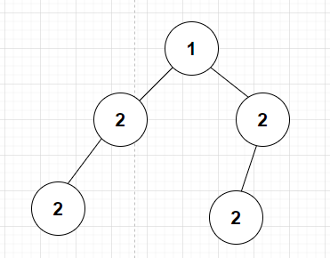
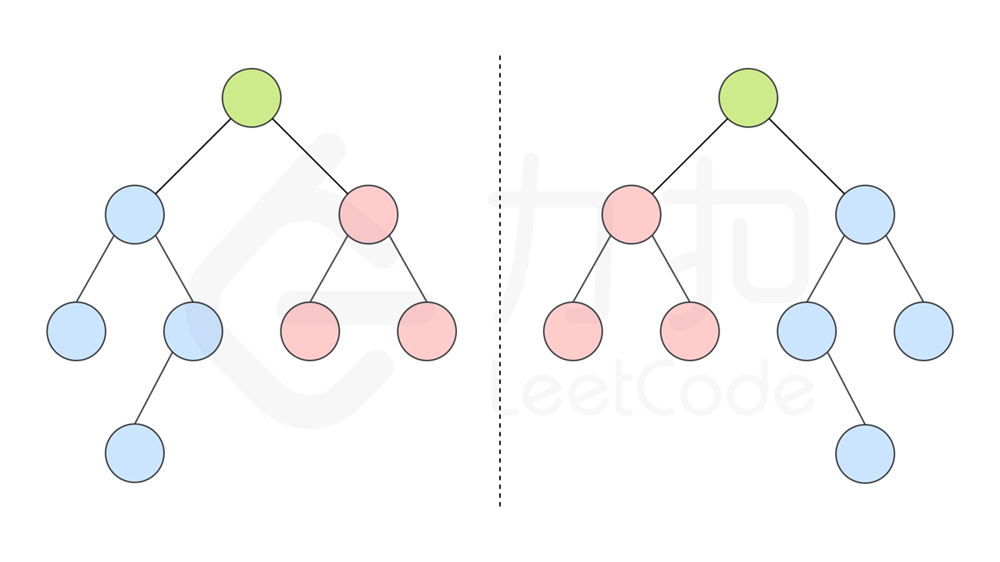

[101. 对称二叉树 - 力扣（LeetCode） (leetcode-cn.com)](https://leetcode-cn.com/problems/symmetric-tree/)

> symmetric 对称的

**▍解题标签**

* 二叉树
* 递归

给定一个二叉树，检查它是否是**镜像对称的**。

例如，二叉树 `[1,2,2,3,4,4,3]` 是**对称的**：

~~~
Input: root = [1,2,2,3,4,4,3]
Output: true
~~~

但是下面这个 `[1,2,2,null,3,null,3]` 则**不是镜像对称的**：

~~~
Input: root = [1,2,2,null,3,null,3]
Output: false
~~~

# 解题思路

原先是认为可以使用二叉树的中序遍历解答：

~~~go
package leetcode

import (
	"fmt"
	"math"
)

const (
	topic = "Leetcode Problem 0101. 对称二叉树\n"
)

func init() {
	fmt.Println(topic)
}

type TreeNode struct {
	Val   int
	Left  *TreeNode
	Right *TreeNode
}

func isSymmetric(root *TreeNode) bool {
	tmp := inorderTraversal(root)

	length := len(tmp)
	for index, ele := range tmp {
		if ele != tmp[length-index-1] {
			return false
		}
	}
	return true
}

func inorderTraversal(root *TreeNode) []int {
	if root == nil {
		return nil
	}

	result := make([]int, 0)

	if root.Left == nil && root.Right == nil {
		result = append(result, root.Val)
		return result
	}

	if root.Left != nil {
		result = append(result, inorderTraversal(root.Left)...)
	} else {
		result = append(result, math.MaxInt32)
	}
	result = append(result, root.Val)
	if root.Right != nil {
		result = append(result, inorderTraversal(root.Right)...)
	} else {
		result = append(result, math.MaxInt32)
	}
	return result
}
~~~

但是最终在这个 TestCase 上失败了：`1,2,2,2,null,2`。在尝试了多种方法后，发现**这个解决办法是错误的，也就是被证明是错误的方法**！

> 如何证明？

上述二叉树，中序遍历得到的结果数组是：`[2, 2, 1, 2, 2]`，上述程序判断结果是对称二叉树，但实际上却不是！

通过查看评论和题解，这道题仍然是**递归问题**：

~~~
递归的难点在于：找到可以递归的点 为什么很多人觉得递归一看就会，一写就废。 或者说是自己写无法写出来，关键就是你对递归理解的深不深。

对于此题： 递归的点怎么找？从拿到题的第一时间开始，思路如下：

1.怎么判断一棵树是不是对称二叉树？ 答案：如果所给根节点，为空，那么是对称。如果不为空的话，当他的左子树与右子树对称时，他对称

2.那么怎么知道左子树与右子树对不对称呢？在这我直接叫为左树和右树 答案：如果左树的左孩子与右树的右孩子对称，左树的右孩子与右树的左孩子对称，那么这个左树和右树就对称。

仔细读这句话，是不是有点绕？怎么感觉有一个功能A我想实现，但我去实现A的时候又要用到A实现后的功能呢？

当你思考到这里的时候，递归点已经出现了： 递归点：我在尝试判断左树与右树对称的条件时，发现其跟两树的孩子的对称情况有关系。

想到这里，你不必有太多疑问，上手去按思路写代码，函数A（左树，右树）功能是返回是否对称

def 函数A（左树，右树）： 左树节点值等于右树节点值 且 函数A（左树的左子树，右树的右子树），函数A（左树的右子树，右树的左子树）均为真 才返回真

实现完毕。。。

写着写着。。。你就发现你写出来了。。。。。。
~~~

最终的代码实现：

~~~go
/**
 * Definition for a binary tree node.
 * type TreeNode struct {
 *     Val int
 *     Left *TreeNode
 *     Right *TreeNode
 * }
 */
func isSymmetric(root *TreeNode) bool {
	return symmetricTest(root.Left, root.Right)
}

// 封装一个递归判断的函数，必须是同一height
func symmetricTest(node1, node2 *TreeNode) bool {
    // 第一层，判断 node1 和 node2 的 Val
	if (node1 != nil && node2 == nil) ||
		(node1 == nil && node2 != nil) {
		return false
	}

	if node1 == nil && node2 == nil {
		return true
	}

	if node1.Val != node2.Val {
		return false
	}

    // 第二层判断 left and right tree
	// root 的 left tree's left node 和 right tree's right node
	// root 的 left tree's right node 和 right tree's left node
	return symmetric(node1.Left, node2.Right) && symmetric(node1.Right, node2.Left)
}
~~~

上述代码的关于 node1 和 node2 相关情况的判断，还可以更进一步优化：

~~~go
// 封装一个递归判断的函数，必须是同一height
func symmetricTest(node1, node2 *TreeNode) bool {
    if node1 == nil && node2 == nil {
        return true
    }
    
    if node1 == nil || node2 == nil {
        return false
    }

    // 第二层判断 left and right tree
	// root 的 left tree's left node 和 right tree's right node
	// root 的 left tree's right node 和 right tree's left node
	return node1.Val == node2.Val && symmetricTest(node1.Left, node2.Right) && symmetricTest(node1.Right, node2.Left)
}
~~~

整个解题思路的递推公式是：

isSymmetric(node) = symmetricTest(node, node)

symmetricTest(node, node) = symmetricTest(node.Left, node.Right) && symmetricTest(node.Right, node.Left) && checkNode(node, node)

递归的思想，关键在于写出**递推公式**，考虑形成**递归的“点”**。**既有“递”，也有“归”**！

# 附

LeetCode 官方的解答思路是这样的：

如果**一个树**的**左子树**与**右子树**镜像对称，那么这个树是对称的。就如下面这样：

因此，该问题可以**转化**为：**两个树**在什么情况下互为镜像？

如果同时满足下面的条件，两个树互为镜像：

- 它们的两个根结点具有相同的值
- 每个树的右子树都与另一个树的左子树镜像对称；同样的，每个树的左子树都与另一个树的右子树镜像对称

我们可以实现这样一个递归函数，通过**「同步移动」**两个指针的方法来遍历这棵树，pp 指针和 qq 指针一开始都指向这棵树的根，随后 pp 右移时，qq 左移，pp 左移时，qq 右移。每次检查当前 pp 和 qq 节点的值是否相等，如果相等再判断左右子树是否对称。

> 「同步移动」就是我所思考的，相互比较的两个 TreeNode 必须是同一个 Height 的。

对应的代码实现：

~~~go
func isSymmetric(root *TreeNode) bool {
    return check(root, root) // 将一棵树的镜像问题，转化成两棵树的镜像对称问题
}

func check(p, q *TreeNode) bool {
    if p == nil && q == nil {
        return true
    }
    if p == nil || q == nil { // 只要满足 p == nil 或者 q == nil，那么另外一个一定是 nil
        return false
    }
    return p.Val == q.Val && check(p.Left, q.Right) && check(p.Right, q.Left) 
}
~~~

