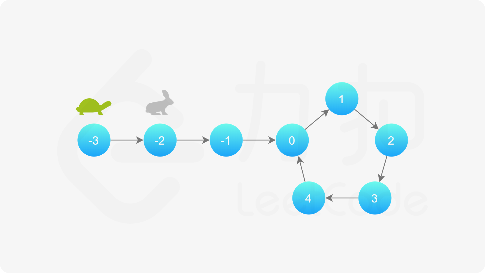

[141. 环形链表 - 力扣（LeetCode） (leetcode-cn.com)](https://leetcode-cn.com/problems/linked-list-cycle/)

**▍解题标签**

* 单链表——环形链表
* 快慢指针

给定一个链表，判断链表中是否有环。

如果链表中有某个节点，可以通过**连续跟踪** next 指针再次到达，则链表中存在环。 为了表示给定链表中的环，我们使用整数 pos 来表示链表尾连接到链表中的位置（索引从 0 开始）。 如果 pos 是 -1，则在该链表中没有环。注意：pos 不作为参数进行传递，仅仅是为了标识链表的实际情况。

如果链表中存在环，则返回 true 。 否则，返回 false 。

**进阶：**

你能用 O(1)（即，常量）内存解决此问题吗？

**示例 1：**


```
输入：head = [3,2,0,-4], pos = 1
输出：true
解释：链表中有一个环，其尾部连接到第二个节点。
```

**示例 2：**


```
输入：head = [1,2], pos = 0
输出：true
解释：链表中有一个环，其尾部连接到第一个节点。
```

**示例 3：**


```
输入：head = [1], pos = -1
输出：false
解释：链表中没有环。
```

**提示：**

- 链表中节点的数目范围是 `[0, 104]`
- `-105 <= Node.val <= 105`
- `pos` 为 `-1` 或者链表中的一个 **有效索引** 。

# 解题思路

这道题的特征在于：

* 数据结构是在**单链表**上，题目要求是要去判断单链表的环状结构；
* 环状结构的特征是：一旦进入到环状结构后，持续遍历其中的节点，必然会回到已经遍历过的位置！

最简单的方法是快慢指针法，但是问题在于：**如何去证明，在有环存在的情况下，快慢指针必然会相遇**？

本方法需要读者对「Floyd 判圈算法」（又称**龟兔赛跑算法**）有所了解。

假想「乌龟」和「兔子」在链表上移动，「兔子」跑得快，「乌龟」跑得慢。当「乌龟」和「兔子」从链表上的同一个节点开始移动时，如果该链表中没有环，那么「兔子」将一直处于「乌龟」的前方；如果该链表中有环，那么「兔子」会先于「乌龟」进入环，并且一直在环内移动。等到「乌龟」进入环时，由于「兔子」的速度快，它一定会在某个时刻与乌龟相遇，即套了「乌龟」若干圈。

我们可以根据上述思路来解决本题。具体地，我们定义两个指针，一快一满。慢指针每次只移动一步，而快指针每次移动两步。初始时，慢指针在位置 head，而快指针在位置 head.next。这样一来，如果在移动的过程中，快指针反过来追上慢指针，就说明该链表为环形链表。否则快指针将到达链表尾部，该链表不为环形链表。



当慢指针也进入环后，就形成了快指针在后面追慢指针的情形，并且跑道是无限长的。 注意：快指针不可能一步从落后慢指针的位置移动到领先慢指针的位置，因为这**至少需要快指针一次移动三步**，因为慢指针不会停着不动，他也同时向前移动了一步。 故，快指针必然与慢指针相遇。

代码实现如下：

~~~go
package leetcode

import (
	"fmt"
)

const (
	topic = "Leetcode Problem 0141 环形链表\n"
)

func init() {
	fmt.Println(topic)
}

type ListNode struct {
	Val  int
	Next *ListNode
}

func hasCycle(head *ListNode) bool {
	slow := head
	fast := head

	// [] -1
	// [1] -1
	// [1 2] 0
	// [3 2 0 -4] 1
	// [-21,10,17,8,4,26,5,35,33,-7,-16,27,-12,6,29,-12,5,9,20,14,14,2,13,-24,21,23,-21,5] -1
	for slow != nil && fast != nil {
		slow = slow.Next
		fast = fast.Next
		if fast == nil {
			break
		}
		fast = fast.Next

		if slow == fast {
			return true
		}
	}

	return false
}
~~~

算法 AC 情况：

~~~
执行用时：8 ms, 在所有 Go 提交中击败了82.49%的用户
内存消耗：4.3 MB, 在所有 Go 提交中击败了99.97%的用户
~~~

当然还有另外一个中解题思路：

~~~go
func hasCycle(head *ListNode) bool {
	hashmap := make(map[*ListNode]struct{})
	pointer := head
	for pointer != nil {
		if _, ok := hashmap[pointer]; ok {
			return true
		}
		hashmap[pointer] = struct{}{}
		pointer = pointer.Next
	}
	return false
}
~~~

最容易想到的方法是遍历所有节点，每次遍历到一个节点时，判断该节点此前是否被访问过。

具体地，我们可以使用**哈希表**来存储所有已经访问过的节点。每次我们到达一个节点，如果该节点已经存在于哈希表中，则说明该链表是环形链表，否则就将该节点加入哈希表中。重复这一过程，直到我们遍历完整个链表即可。

算法 AC 情况：

~~~
执行用时：12 ms, 在所有 Go 提交中击败了18.28%的用户
内存消耗：6 MB, 在所有 Go 提交中击败了10.38%的用户
~~~

