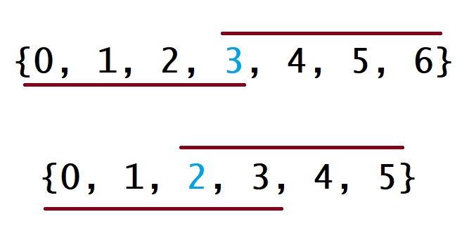

[169. 多数元素 - 力扣（LeetCode） (leetcode-cn.com)](https://leetcode-cn.com/problems/majority-element/)

给定一个大小为 n 的数组，找到其中的多数元素。多数元素是指在数组中**出现次数 大于 ⌊ n/2 ⌋ 的元素**。

你可以假设数组是非空的，并且给定的数组**总是存在多数元素**。

**示例 1：**

```
输入：[3,2,3]
输出：3
```

**示例 2：**

~~~
输入：[2,2,1,1,1,2,2]
输出：2
~~~

**进阶：**

- 尝试设计时间复杂度为 O(n)、空间复杂度为 O(1) 的算法解决此问题。

# 解题思路

这道题对应的数据结构是线序表结构——数组，要找出出现次数大于 n/2 的元素。

出现次数达到某个次数的元素，那就需要做一个**统计**，**使用散列表记录元素出现的次数**：

~~~go
package leetcode

import (
	"fmt"
)

const (
	topic = "Leetcode Problem 0169. 多数元素\n"
)

func init() {
	fmt.Println(topic)
}

func majorityElement(nums []int) int {
	max := len(nums) >> 1
	// key-value:int-number
	hashmap := make(map[int]int)
	for _, value := range nums {
		if num, ok := hashmap[value]; ok {
			hashmap[value] = num + 1
			if hashmap[value] > max {
				return value
			}
		} else {
			hashmap[value] = 1
		}
	}
	return nums[0]
}
~~~

算法 AC 情况：

~~~
执行用时：28 ms, 在所有 Go 提交中击败了7.55%的用户

内存消耗：6 MB, 在所有 Go 提交中击败了18.38%的用户
~~~

算法复杂度分析：

* 时间复杂度：需要统计出数组元素的出现次数，需要遍历一遍数组，复杂度是 O(n)
* 空间复杂度：使用了散列表存储元素出现的次数，复杂度至少是 O(n)。出现散列冲突时，使用链式法解决冲突。

那**是否有时间复杂度为 O(n)、空间复杂度为 O(1) 的算法**？

我们来看看数组的特点：数组元素无序。因为无序，是否可以通过排序后，用双指针法得到元素出现的次数？

数组的排序算法有很多，而且时间复杂度和空间复杂度各不相同。我们使用**堆排序**算法，可以做到空间复杂度为 O(1)：

~~~go
func majorityElement(nums []int) int {
	nums = heapSort(nums)
	return nums[len(nums)>>1]
}

func heapSort(arr []int) []int {
	arrLen := len(arr)
	buildMaxHeap(arr, arrLen)
	for i := arrLen - 1; i >= 0; i-- {
		swap(arr, 0, i)
		arrLen -= 1
		heapify(arr, 0, arrLen)
	}
	return arr
}

func buildMaxHeap(arr []int, arrLen int) {
	for i := arrLen / 2; i >= 0; i-- {
		heapify(arr, i, arrLen)
	}
}

func heapify(arr []int, i, arrLen int) {
	left := 2*i + 1
	right := 2*i + 2
	largest := i
	if left < arrLen && arr[left] > arr[largest] {
		largest = left
	}
	if right < arrLen && arr[right] > arr[largest] {
		largest = right
	}
	if largest != i {
		swap(arr, i, largest)
		heapify(arr, largest, arrLen)
	}
}

func swap(arr []int, i, j int) {
	arr[i], arr[j] = arr[j], arr[i]
}
~~~

那此处应用到了 2 个知识点：

1. 堆排序，时间复杂度是 O(n)，空间复杂度是 O(1)
2. 数组下标是 len(nums)/2 的元素一定是众数。

下面来证明上述结论：数组下标是 len(nums)/2 的元素一定是众数

在下图中，第一个例子是 n 为奇数的情况，第二个例子是 n 为偶数的情况：



对于每种情况，数组下面的线表示如果众数是数组中的**最小值**时覆盖的下标，数组上面的线表示如果众数是数组中的**最大值**时覆盖的下标。对于其他的情况，这条线会在这两种**极端情况**的中间。对于这两种极端情况，会在下标是 len(nums)/2 的位置重叠，因此返回该值一定是众数！
