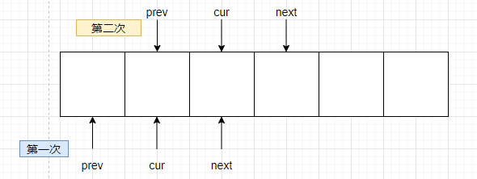

[206. 反转链表 - 力扣（LeetCode） (leetcode-cn.com)](https://leetcode-cn.com/problems/reverse-linked-list/)

给你单链表的头节点 `head` ，请你反转链表，并返回反转后的链表。

**示例 1：**


~~~
输入：head = [1,2,3,4,5]
输出：[5,4,3,2,1]
~~~

**示例 2：**


~~~
输入：head = [1,2]
输出：[2,1]
~~~

**示例 3：**

```
输入：head = []
输出：[]
```

**提示**：

* 链表中节点的数目范围是 [0, 5000]
* -5000 <= Node.val <= 5000


进阶：链表可以选用**迭代**或**递归**方式完成反转。你能否用两种方法解决这道题？

# 解题思路

该题的数据结构是**单链表**，目的是反转这个单链表。

~~~go
func reverseList(head *ListNode) *ListNode {
    // 考虑边界条件
	if head == nil || head.Next == nil {
		return head
	}

	prev := head
	cur := prev.Next
	// cur != nil 已在 if 中过滤
	next := cur.Next

    // 考虑首节点
	prev.Next = nil
	// cur.Next = prev
	// [1,2,3,4,5] --> [5,4,3,2,1]
	for cur != nil {
		cur.Next = prev
		prev = cur
		cur = next
		if cur != nil {
			next = cur.Next
		}
	}
	return prev
}
~~~

上述算法实现，本质上是一种**迭代**实现，也就是说每次 for 循环会让其中的 prev、cur、next 指针在单链表中重新赋值，指向不同的节点。

算法 AC 执行结果：

~~~
执行用时：0 ms, 在所有 Go 提交中击败了100.00%的用户

内存消耗：2.5 MB, 在所有 Go 提交中击败了99.90%的用户
~~~

考虑使用**递归**实现：



# 测试用例

上述 reverseList 的测试用例可以为：

1. `[]`：边界条件
2. `[1,2]`：边界条件
3. `[1,2,3,4,5]`：常规测试用例

