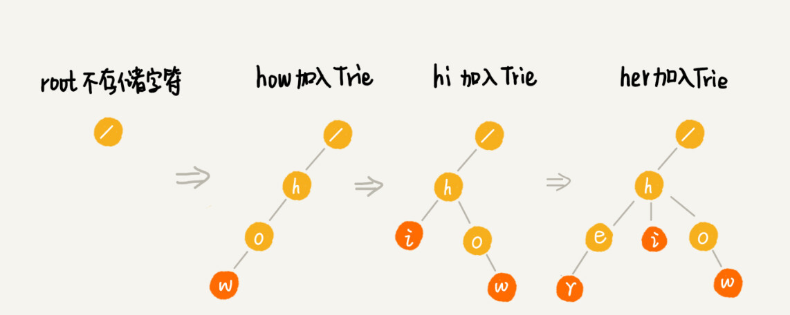

[208. 实现 Trie (前缀树)](https://leetcode-cn.com/problems/implement-trie-prefix-tree/)

Trie（发音类似 "try"）或者说 前缀树 是一种**树形数据结构**，（应用场景）用于高效地**存储和检索字符串数据集**中的键。这一数据结构有相当多的应用情景，例如自动补完和拼写检查。

请你实现 Trie 类：

* Trie() 初始化前缀树对象。
* void insert(String word) 向前缀树中插入字符串 word 。
* boolean search(String word) 如果字符串 word 在前缀树中，返回 true（即，在检索之前已经插入）；否则，返回 false 。
* boolean startsWith(String prefix) 如果之前已经插入的字符串 word 的前缀之一为 prefix ，返回 true ；否则，返回 false 。

**示例：**

~~~
输入
["Trie", "insert", "search", "search", "startsWith", "insert", "search"]
[[], ["apple"], ["apple"], ["app"], ["app"], ["app"], ["app"]]
输出
[null, null, true, false, true, null, true]

解释
Trie trie = new Trie();
trie.insert("apple");
trie.search("apple");   // 返回 True
trie.search("app");     // 返回 False
trie.startsWith("app"); // 返回 True
trie.insert("app");
trie.search("app");     // 返回 True
~~~

**提示：**

* 1 <= word.length, prefix.length <= 2000
* word 和 prefix 仅由小写英文字母组成
* insert、search 和 startsWith 调用次数 总计 不超过 3 * 104 次

# 解题思路

这道题目对应的数据结构是树，而因为其特殊的使用场景，构造出了特定的数据结构：Trie 树——前缀树。

解题思路的关键点：构造出 Trie 的数据结构！

~~~go
/**
 * Your Trie object will be instantiated and called as such:
 * obj := Constructor();
 * obj.Insert(word);
 * param_2 := obj.Search(word);
 * param_3 := obj.StartsWith(prefix);
 */

type Trie struct {
	children [26]*Trie // 使用一个数组——包含 26 个元素的数组——代表 Trie 的每个节点
	isEnd    bool
}

func Constructor() Trie {
	return Trie{
		children: [26]*Trie{}, // 如果某个 index 存在，说明包含该位置索引对应的字符
		isEnd:    false,
	}
}

func (trie *Trie) Insert(word string) {
	// word 拆分成一个个字符
	children := trie.children[word[0]-'a']
	if len(word) == 1 {
		if children == nil {
			trie.children[word[0]-'a'] = &Trie{
				children: [26]*Trie{},
				isEnd:    true,
			}
		} else {
			children.isEnd = true // 新插入节点时，原先已存在，则更新 isEnd 值
		}
	} else {
		if children == nil {
			trie.children[word[0]-'a'] = &Trie{
				children: [26]*Trie{},
				isEnd:    false,
			}
		}
		trie.children[word[0]-'a'].Insert(word[1:])
	}
}

func (trie *Trie) Search(word string) bool {
	for index, ele := range word {
		children := trie.children[ele-'a']

		if children == nil {
			break
		}

		if index == len(word)-1 && children.isEnd {
			return true
		}
		trie = children
	}
	return false
}

func (trie *Trie) StartsWith(prefix string) bool {
	for index, ele := range prefix {
		children := trie.children[ele-'a']

		if children == nil {
			break
		}

		if index == len(prefix)-1 {
			return true
		}
		trie = children
	}
	return false
}
~~~

算法 AC 的情况：

~~~
执行用时：80 ms, 在所有 Go 提交中击败了9.35%的用户
内存消耗：17.3 MB, 在所有 Go 提交中击败了66.58%的用户
~~~

对于上述算法的思路，还有另外一种代码实现，这种方式**代码简洁易懂且高效**：

~~~go
func (trie *Trie) Insert(word string) {
	node := trie
	for _, ch := range word {
		ch -= 'a'
		if node.children[ch] == nil {
			node.children[ch] = &Trie{}
		}
		node = node.children[ch]
	}
	node.isEnd = true
}
~~~

鉴于 Search 和 StartsWith 在功能上有相似性，可**抽取出共同的部分**：

~~~go
func (trie *Trie) SearchPrefix(prefix string) *Trie {
	node := trie
	for _, ch := range prefix {
		ch -= 'a'
		children := node.children[ch]
		if children == nil {
			return nil
		}
		node = children
	}
	return node
}

func (trie *Trie) Search(word string) bool {
	node := trie.SearchPrefix(word)
	return node != nil && node.isEnd
}

func (trie *Trie) StartsWith(prefix string) bool {
	node := trie.SearchPrefix(prefix)
	return node != nil
}
~~~

算法 AC 情况：

~~~
执行用时：52 ms, 在所有 Go 提交中击败了76.06%的用户
内存消耗：17.7 MB, 在所有 Go 提交中击败了31.45%的用户
~~~
